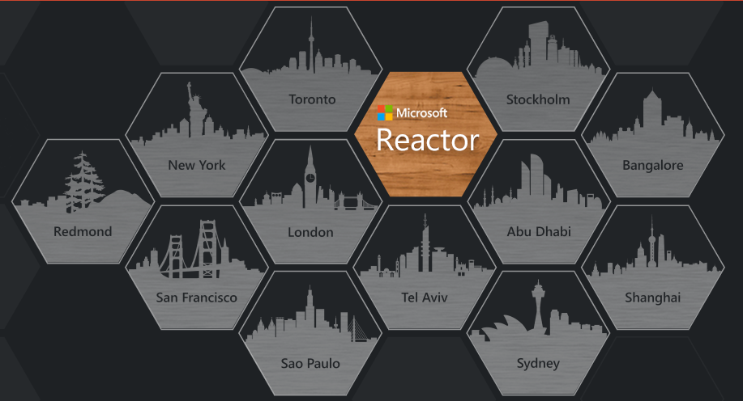
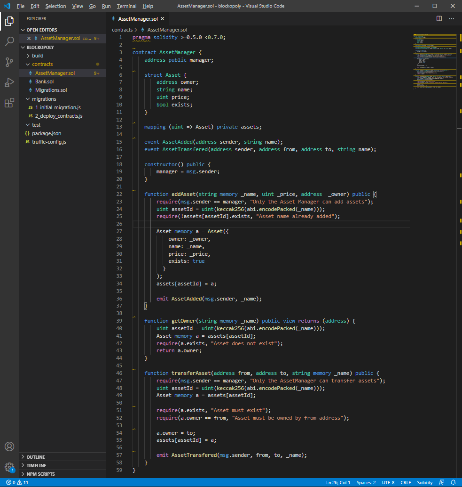
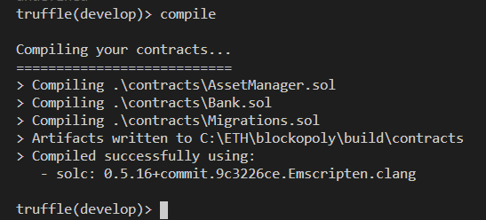
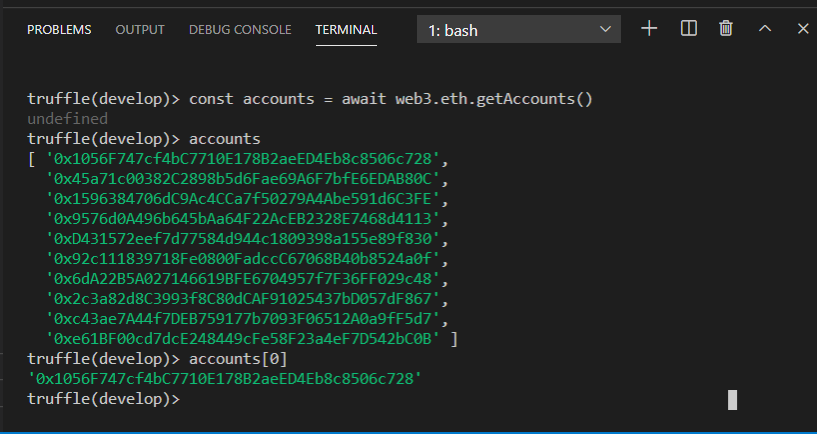
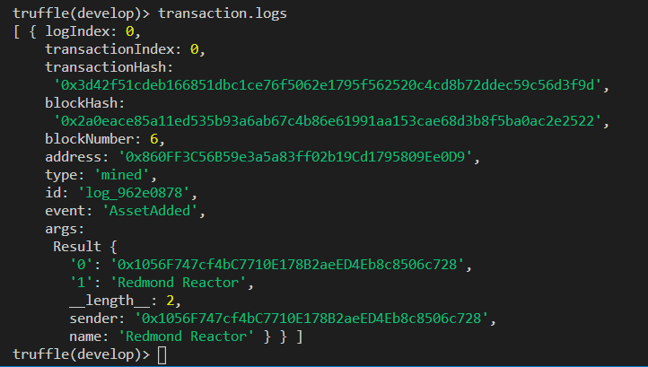
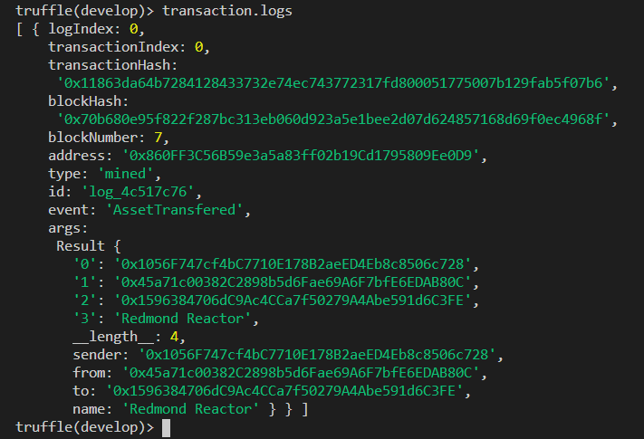

# Blockopoly - parte 2

Por: [Solange Gueiros](https://solange.dev/)

Nosso jogo é composto por 3 smart contracts: 
- Bank
- AssetManager
- Blockopoly

Na [parte 1](../Tutorial_part01/README.md) apresentamos a arquitetura do jogo e criamos o primeiro smart contract: `Bank`, que controla o dinheiro, os saldos de cada um, a emissão e as transferências entre contas.  

Nesta segunda parte do tutorial continuaremos o desenvolvimento do smart contract `AssetManager`. 

# Asset Manager

`AssetManager` é um gerenciador de ativos, no nosso caso é o administrador das propriedades que serão negociadas. 

As propriedades do nosso jogo serão os espaços [Microsoft Reactors](https://developer.microsoft.com/en-us/reactor/) espalhados pelo mundo:



* Redmond Reactor
* Seattle Reactor
* San Francisco Reactor
* New York Reactor
* Toronto Reactor
* London Reactor
* Sao Paulo Reactor
* Tel Aviv Reactor
* Stockholm Reactor
* Abu Dhabi Reactor
* Sydney Reactor
* Shanghai Reactor
* Bangalore Reactor

Nestes espaços profissionais da área se encontram, aprendem e se conectam - tanto aos colegas locais quanto às idéias e tecnologias líderes da indústria na Microsoft, parceiros e comunidades de código aberto.

## Crie o smart contract AssetManager

Abra o projeto `blockopoly` no VS Code. Na pasta `contracts`, crie um novo arquivo chamado `AssetManager.sol`.

Copie e cole o código fonte:

```javascript
pragma solidity >=0.5.0 <0.7.0;
 
contract AssetManager {
    address public manager;
 
    struct Asset {
        address owner;
        string name;
        uint price;
        bool exists;
    }
 
    mapping (uint => Asset) private assets;
 
    event AssetAdded(address sender, string name);
    event AssetTransfered(address sender, address from, address to, string name);

    constructor() public {
        manager = msg.sender;
    }
 
    function addAsset(string memory _name, uint _price, address  _owner) public {
        require(msg.sender == manager, "Only the Asset Manager can add assets");
        uint assetId = uint(keccak256(abi.encodePacked(_name)));
        require(!assets[assetId].exists, "Asset name already added");
 
        Asset memory a = Asset({
            owner: _owner,
            name: _name,
            price: _price,
            exists: true
          }
        ); 
        assets[assetId] = a;

        emit AssetAdded(msg.sender, _name);
    }
 
    function getOwner(string memory _name) public view returns (address) {
        uint assetId = uint(keccak256(abi.encodePacked(_name)));
        Asset memory a = assets[assetId];
        require(a.exists, "Asset does not exist");
        return a.owner;
    }
 
    function transferAsset(address from, address to, string memory _name) public {
        require(msg.sender == manager, "Only the AssetManager can transfer assets");
        uint assetId = uint(keccak256(abi.encodePacked(_name)));
        Asset memory a = assets[assetId];
 
        require(a.exists, "Asset must exist");
        require(a.owner == from, "Asset must be owned by from address");
 
        a.owner = to;
        assets[assetId] = a;
 
        emit AssetTransfered(msg.sender, from, to, _name);
    }
}
```

Ficará desta forma: 



## AssetManager.sol

Este smart contract contém:

### Variáveis

* Uma variável pública `manager` para saber qual o endereço do administrador de ativos.
* Uma estrutura chamada `Asset`, que armazena todas as informações de um ativo: proprietário, nome do ativo, preço e se ele existe.
* Um mapping chamado `assets`, privado, que armazena um identificador associando-o a uma estrutura com as informações de um ativo.

### Eventos

* Um evento `AssetAdded` que avisa quando algum ativo for adicionado no jogo.
* Um evento `AssetTransfer` que avisa quando algum ativo for transferido de um endereço a outro no jogo.

### Construtor

O `constructor` (construtor), executado apenas no momento da criação do smart contract, define quem é o `manager`.

### Funções

* Uma função `addAsset` que adiciona os ativos no jogo.
* Uma função `getOwner` que retorna quem é o proprietário de um ativo.
* Uma função `transferAsset` para transferir um ativo de uma pessoa para outra.

## Compile o smart contract

No `Truffle development console`, digite:

```shell
compile
```

Veja o resultado com a mensagem `Compiled successfully`:



## Publique o smart contract

Primeiro precisamos criar um arquivo com instruções para publicação. 
Ao encontrá-lo, Truffle vai processá-lo no momento do deploy.

### Atualize o arquivo 2_deploy_contracts.js

No diretório `migrations`, já criamos o arquivo `2_deploy_contracts.js` com as instruções para a publicação do smart contract `Bank`.

Vamos atualizar o arquivo para incluir a publicação do smart contract `AssetManager`.

Substitua por este:

```javascript
var Bank = artifacts.require("Bank");
var AssetManager = artifacts.require("AssetManager");

module.exports = function(deployer) {
  deployer.deploy(Bank);
  deployer.deploy(AssetManager);
};
```

Veja o resultado: 


### Migrate

No `Truffle development console`, faça a publicação dos contratos especificados no diretório `migrations`.

Utilize o parâmetro `--reset` para publicar novamente todos os smart contracts:

```shell
migrate --reset
```

Veja os resultado específico da publicação do `AssetManager`: 


# Interagindo com o smart contract

Vamos interagir com o `AssetManager` através do Truffle console.

## Suas contas / endereços

No Truffle console:

```javascript
const accounts = await web3.eth.getAccounts()
```

Para listar todas as contas depois:

```javascript
accounts
```

Para olhar cada conta:

```javascript
accounts[0]
accounts[1]
```



## Faça a conexão com AssetManager

Vamos atribuir a variável `assetManager` a instância do smart contract `AssetManager` já publicado:

```javascript
const assetManager = await AssetManager.deployed()
```

Verifique se a instância está OK.

Escreva o nome da variável:  `assetManager`, tecle `.` e depois aperte a tecla TAB duas vezes para acionar o recurso autocompletar. 
Será apresentado o endereço e hash da transação na publicação, além de outras coisas, incluindo todas as váriaveis e métodos públicos disponíveis. 

```javascript
assetManager. [TAB] [TAB]
```


## Manager

No Truffle console:

```javascript
assetManager.manager()
```

Perceba que o gerente é a conta que fez a publicação do smart contract. 
Dado que nenhuma conta foi especificada no arquivo `2_deploy_contracts.js`, é utilizada como default a primeira conta da lista, que é a `accounts[0]`


## Adicionar propriedade

Vamos executar a função `addAsset` com os seguintes parâmetros:

* nome: `Redmond Reactor`
* preço: `100`
* dono: o endereço: `0x45a71c00382C2898b5d6Fae69A6F7bfE6EDAB80C`

```javascript
var transaction = await assetManager.addAsset("Redmond Reactor", 100, "0x45a71c00382C2898b5d6Fae69A6F7bfE6EDAB80C")
```

Guardamos os detalhes da transação na variável `transaction`.

Veja os detalhes:

```javascript
transaction
```


## Evento *AssetAdded*

Veja a parte de logs da transação `addAsset`. Você encontrará o evento `AssetAdded`, com os detalhes da inclusão da propriedade:

* '0': Sender - quem cadastrou
* '1': Name - nome da propriedade

```javascript
transaction.logs
```



## Dono de uma propriedade

Para saber quem é o dono de uma propriedade, utilize a função `getOwner`. 

Por exemplo, vamos verificar a propriedade cadastrada anteriormente.  Preencha o parâmetro: `Redmond Reactor`. 

```javascript
assetManager.getOwner("Redmond Reactor")
```


O resultado é o endereço da conta cadastrada anteriormente.

## Transferir propriedade

Utilize a função `transferAsset` para transferir uma propriedade. Entendendo os parâmetros:

* From: o dono atual
* To: o novo dono, para quem vai transferir
* Name: nome da propriedade

Por exemplo, vamos transferir a propriedade cadastrada anteriormente para a conta `0x1596384706dC9Ac4CCa7f50279A4Abe591d6C3FE`.  Preencha os parâmetros:

* From: `0x45a71c00382C2898b5d6Fae69A6F7bfE6EDAB80C`
* To: `0x1596384706dC9Ac4CCa7f50279A4Abe591d6C3FE`
* Name: `Redmond Reactor`

```javascript
transaction = await assetManager.transferAsset("0x45a71c00382C2898b5d6Fae69A6F7bfE6EDAB80C", "0x1596384706dC9Ac4CCa7f50279A4Abe591d6C3FE", "Redmond Reactor")
```

Guardamos os detalhes da transação na variável `transaction`. Veja os detalhes:

```javascript
transaction
```


## Evento *AssetTransfered*

Veja os logs da transação `transferAsset`. Você encontrará o evento `AssetTransfered`, com os detalhes da transferência da propriedade:

* '0': Sender - quem enviou a transação
* '1': From - dono anterior
* '2': To - novo dono
* '3': Name - nome da propriedade

Veja em nosso exemplo:

```javascript
transaction.logs
```



# Próximos passos

Nesta parte do tutorial do jogo `Blockopoly` você aprendeu como criar o smart contract `AssetManager` utilizando a linguagem Solidity. Este é nosso gerenciador de ativos, ou seja, o administrador das propriedades negociadas. 

Na [parte 1](../Tutorial_part01/README.md) você conheceu a arquitetura do projeto e o primeiro smart contract: `Bank`, que controla o dinheiro: saldos de cada um, emissão e transferências.

Lembre-se que nosso jogo é composto de 3 smart contracts: 

* Bank
* AssetManager
* Blockopoly

Na última parte do tutorial construiremos o "coração" do projeto, que é o smart contract `Blockopoly`. Nele são definidos jogadores, propriedades negociadas, início, final do jogo e o ganhador. Além disto, demonstraremos o funcionamento de uma partida.

Continue em [Blockopoly - parte 3](../Tutorial_part03/README.md).
